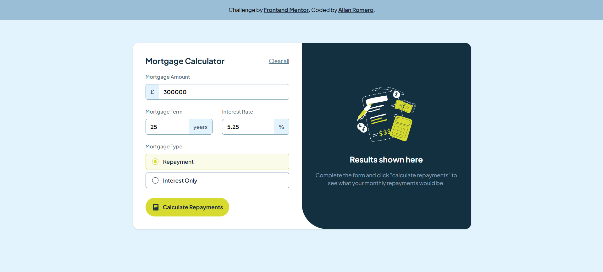

# Frontend Mentor - Browser extensions manager UI solution

This is a solution to the [Mortgage repayment calculator challenge on Frontend Mentor](https://www.frontendmentor.io/challenges/mortgage-repayment-calculator-Galx1LXK73). Frontend Mentor challenges help you improve your coding skills by building realistic projects.

## Table of contents

- [The challenge](#the-challenge)
- [Screenshot](#screenshot)
- [Links](#links)
- [My process](#my-process)
  - [Built with](#built-with)
  - [What I learned](#what-i-learned)
  - [Useful resources](#useful-resources)
- [Author](#author)

### The challenge

Users should be able to:

- Input mortgage information and see monthly repayment and total repayment amounts after submitting the form
- See form validation messages if any field is incomplete
- Complete the form only using their keyboard
- View the optimal layout for the interface depending on their device's screen size
- See hover and focus states for all interactive elements on the page

### Screenshot

#### Desktop

#### Mobile

### Links

- Solution URL: [https://github.com/AllanRS19/mortgage-repayment-calculator](https://github.com/AllanRS19/mortgage-repayment-calculator)
- Live Site URL: [https://mortgage-repayment-calculator-silk.vercel.app/](https://mortgage-repayment-calculator-silk.vercel.app/)

## My process

### Built with

- [Vite]
- [React]
- [TailwindCSS]
- [React Hook Form]
- Flexbox
- Mobile-first workflow

### What I learned

During this project, I learned how to implement complex financial formulas to calculate repayment schedules accurately, as well as how to manage user input efficiently using React and TypeScript. I also improved my skills in designing an intuitive UI that adapts seamlessly to different screen sizes, ensuring accessibility and clarity for all users.

### Useful resources

- [Vite Documentation](https://vite.dev/guide/) - This is the Vite documentation page, which is what I used to develop this application. In there, I was able to gather and search all the information that I needed to succeed in this challenge.
- [TailwindCSS Documentation](https://tailwindcss.com/docs/dark-mode) - This is by far my preferred CSS framework to style my applications. I used the guide to enable the dark mode feature.
- [React Hook Form Documentation](https://react-hook-form.com/) - I was impressed by how easy React Hook Form makes working with forms. It was a great help in capturing the information entered in the different form fields.

## Author

- Frontend Mentor - [@AllanRS19](https://www.frontendmentor.io/profile/AllanRS19)